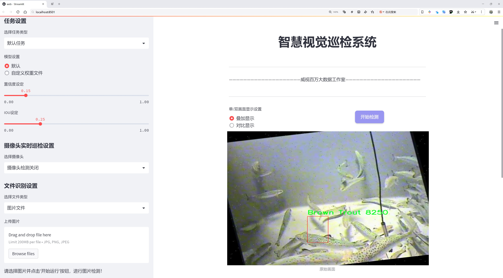
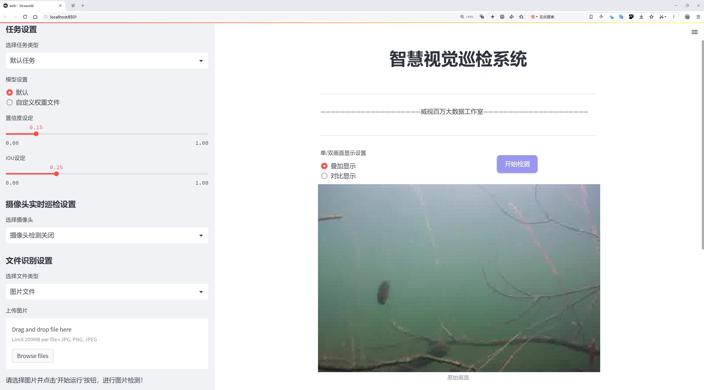
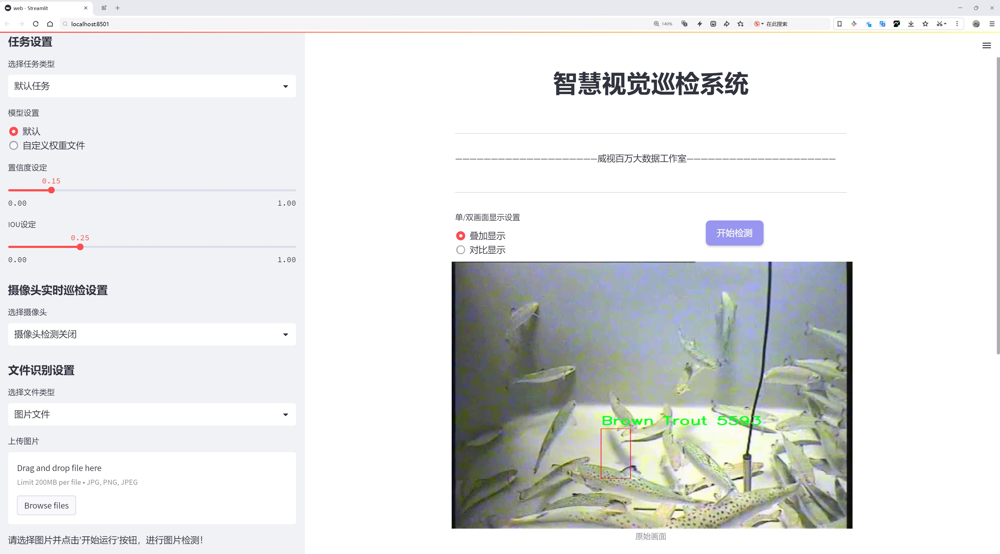
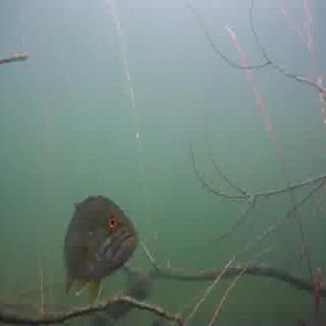
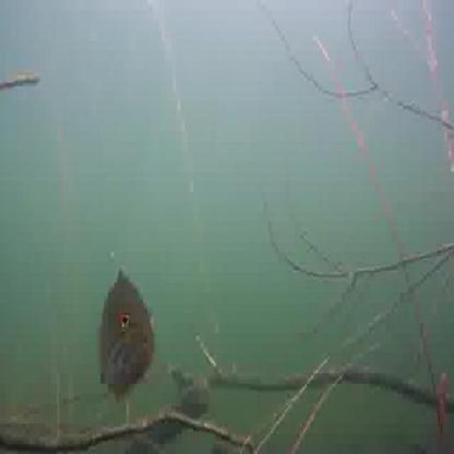
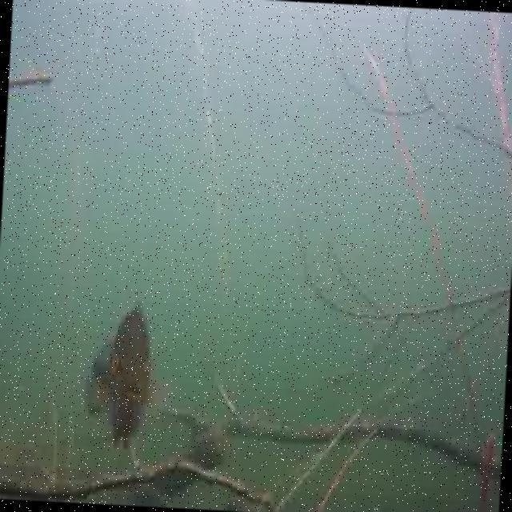
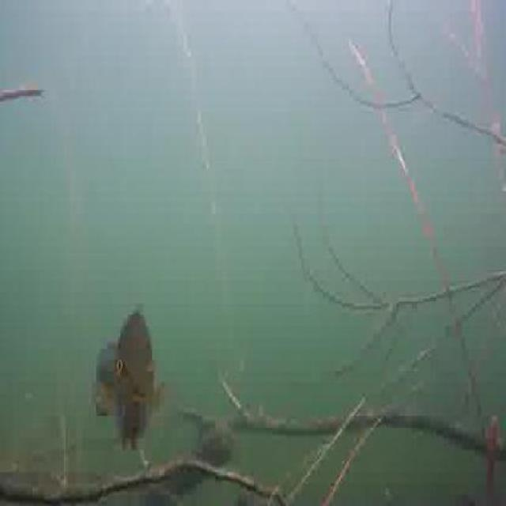
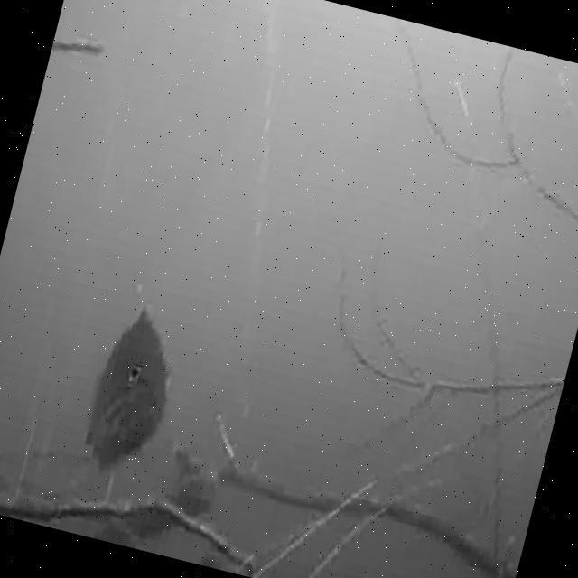

# 鱼类计数与识别检测系统源码分享
 # [一条龙教学YOLOV8标注好的数据集一键训练_70+全套改进创新点发刊_Web前端展示]

### 1.研究背景与意义

项目参考[AAAI Association for the Advancement of Artificial Intelligence](https://gitee.com/qunshansj/projects)

项目来源[AACV Association for the Advancement of Computer Vision](https://gitee.com/qunmasj/projects)

研究背景与意义

随着全球水域生态环境的日益恶化，鱼类资源的保护与管理变得愈发重要。鱼类不仅是水生态系统的重要组成部分，也是人类食物链中的关键环节。因此，准确的鱼类计数与识别对于生态监测、渔业管理及生物多样性保护具有重要意义。传统的鱼类计数方法往往依赖于人工观察和记录，这不仅耗时耗力，而且容易受到观察者主观因素的影响，导致数据的准确性和可靠性降低。近年来，随着计算机视觉技术的迅猛发展，基于深度学习的目标检测算法逐渐成为鱼类计数与识别的有效工具。

YOLO（You Only Look Once）系列算法因其高效的实时检测能力和较高的准确率而受到广泛关注。YOLOv8作为该系列的最新版本，结合了多种先进的深度学习技术，展现出在复杂环境下的强大性能。然而，针对特定领域的应用，尤其是鱼类计数与识别，现有的YOLOv8模型仍存在一定的局限性，例如在特定鱼类种类的识别精度、环境变化下的适应性等方面。因此，基于改进YOLOv8的鱼类计数与识别系统的研究具有重要的理论价值和实际意义。

本研究将利用一个包含1700张图像的数据集，该数据集涵盖了三类鱼类，包括棕色鳟鱼和红侧小鲤等。这些数据不仅为模型的训练提供了丰富的样本，还为模型在不同环境下的泛化能力测试提供了基础。通过对YOLOv8模型的改进，旨在提升其在鱼类计数与识别任务中的表现，尤其是在多类鱼类共存的复杂场景中，提高模型对不同鱼类的区分能力和识别精度。

此外，研究的意义还体现在推动水产养殖与生态保护的智能化进程。通过建立高效的鱼类计数与识别系统，能够为渔业管理者提供实时的鱼类数量与种类信息，帮助其制定科学的捕捞计划和保护措施，进而实现可持续发展目标。同时，该系统也可以为水域生态监测提供数据支持，助力科学研究和政策制定，推动水生态环境的保护与恢复。

综上所述，基于改进YOLOv8的鱼类计数与识别系统的研究，不仅具有重要的学术价值，也为实际应用提供了新的思路与方法。通过该研究，期望能够为鱼类资源的管理与保护提供更为精准和高效的技术支持，为水域生态环境的可持续发展贡献力量。

### 2.图片演示







##### 注意：由于此博客编辑较早，上面“2.图片演示”和“3.视频演示”展示的系统图片或者视频可能为老版本，新版本在老版本的基础上升级如下：（实际效果以升级的新版本为准）

  （1）适配了YOLOV8的“目标检测”模型和“实例分割”模型，通过加载相应的权重（.pt）文件即可自适应加载模型。

  （2）支持“图片识别”、“视频识别”、“摄像头实时识别”三种识别模式。

  （3）支持“图片识别”、“视频识别”、“摄像头实时识别”三种识别结果保存导出，解决手动导出（容易卡顿出现爆内存）存在的问题，识别完自动保存结果并导出到tempDir中。

  （4）支持Web前端系统中的标题、背景图等自定义修改，后面提供修改教程。

  另外本项目提供训练的数据集和训练教程,暂不提供权重文件（best.pt）,需要您按照教程进行训练后实现图片演示和Web前端界面演示的效果。

### 3.视频演示

[3.1 视频演示](https://www.bilibili.com/video/BV1Fst8ejEnZ/)

### 4.数据集信息展示

##### 4.1 本项目数据集详细数据（类别数＆类别名）

nc: 2
names: ['Brown Trout', 'RedSided Shiners']


##### 4.2 本项目数据集信息介绍

数据集信息展示

在本研究中，我们使用了名为“FishCountingApp”的数据集，以改进YOLOv8模型在鱼类计数与识别系统中的表现。该数据集专门针对两种鱼类进行了标注，具有良好的代表性和多样性，能够有效支持模型的训练与测试。数据集的类别数量为2，具体类别包括“Brown Trout”（棕色鳟鱼）和“RedSided Shiners”（红侧小鱼），这两种鱼类在生态系统中具有重要的生物学意义和经济价值。

“FishCountingApp”数据集的构建过程经过精心设计，旨在确保数据的高质量和多样性。每个类别的样本均经过严格筛选，确保涵盖不同的生长阶段、环境条件和视角变化。棕色鳟鱼作为一种广泛分布的淡水鱼，常见于北美的河流和湖泊中，其特征包括流线型的身体和明显的斑点。红侧小鱼则以其鲜艳的颜色和活泼的行为而闻名，通常栖息在清澈的水域中。这两种鱼类的选择不仅考虑了其生态重要性，还考虑了它们在水产养殖和渔业管理中的应用潜力。

数据集中包含的图像经过精心拍摄，确保了在不同光照、背景和水流条件下的多样性。为了提高模型的鲁棒性，数据集还包括了多种拍摄角度和距离的图像，模拟了实际水下观察的复杂性。这种多样性使得模型在面对真实环境中的变化时，能够更好地进行鱼类的识别与计数。

在数据标注方面，所有图像均由专业人员进行标注，确保每个样本的准确性和一致性。标注过程中，采用了先进的图像处理技术，以确保每个鱼类的边界框清晰可见，便于后续的模型训练和评估。此外，数据集还提供了丰富的元数据，包括拍摄时间、地点、环境条件等信息，这些信息为模型的训练提供了更多的上下文，帮助提升模型的性能。

为了验证模型的有效性，我们将“FishCountingApp”数据集划分为训练集和测试集，确保训练过程中的数据多样性和测试过程中的评估准确性。通过对模型在测试集上的表现进行评估，我们能够深入分析YOLOv8在鱼类计数与识别任务中的优缺点，从而为后续的改进提供数据支持。

总之，“FishCountingApp”数据集为本研究提供了一个坚实的基础，使得我们能够在鱼类计数与识别领域探索新的技术路径。通过对数据集的深入分析和模型的不断优化，我们期望能够实现更高的识别精度和更快的处理速度，为生态监测和渔业管理提供有效的技术支持。











### 5.全套项目环境部署视频教程（零基础手把手教学）

[5.1 环境部署教程链接（零基础手把手教学）](https://www.ixigua.com/7404473917358506534?logTag=c807d0cbc21c0ef59de5)


[5.2 安装Python虚拟环境创建和依赖库安装视频教程链接（零基础手把手教学）](https://www.ixigua.com/7404474678003106304?logTag=1f1041108cd1f708b01a)

### 6.手把手YOLOV8训练视频教程（零基础小白有手就能学会）

[6.1 手把手YOLOV8训练视频教程（零基础小白有手就能学会）](https://www.ixigua.com/7404477157818401292?logTag=d31a2dfd1983c9668658)

### 7.70+种全套YOLOV8创新点代码加载调参视频教程（一键加载写好的改进模型的配置文件）

[7.1 70+种全套YOLOV8创新点代码加载调参视频教程（一键加载写好的改进模型的配置文件）](https://www.ixigua.com/7404478314661806627?logTag=29066f8288e3f4eea3a4)

### 8.70+种全套YOLOV8创新点原理讲解（非科班也可以轻松写刊发刊，V10版本正在科研待更新）

由于篇幅限制，每个创新点的具体原理讲解就不一一展开，具体见下列网址中的创新点对应子项目的技术原理博客网址【Blog】：


[8.1 70+种全套YOLOV8创新点原理讲解链接](https://gitee.com/qunmasj/good)

### 9.系统功能展示（检测对象为举例，实际内容以本项目数据集为准）

图9.1.系统支持检测结果表格显示

  图9.2.系统支持置信度和IOU阈值手动调节

  图9.3.系统支持自定义加载权重文件best.pt(需要你通过步骤5中训练获得)

  图9.4.系统支持摄像头实时识别

  图9.5.系统支持图片识别

  图9.6.系统支持视频识别

  图9.7.系统支持识别结果文件自动保存

  图9.8.系统支持Excel导出检测结果数据


### 10.原始YOLOV8算法原理

原始YOLOv8算法原理

YOLOv8是由Ultralytics团队于2023年推出的最新目标检测算法，作为YOLO系列的延续，它在YOLOv5的基础上进行了多项重要改进。YOLOv8的设计理念旨在提升目标检测的速度和精度，特别是在实时应用场景中表现出色。本文将详细探讨YOLOv8的原理及其创新之处，特别是YOLOv8n版本的架构。

首先，YOLOv8的网络结构分为输入层、主干网络、颈部网络和头部网络四个主要部分。输入层负责接收图像数据，YOLOv8在这一阶段引入了多种数据增强技术，如马赛克增强、混合增强等，以提高模型的鲁棒性和泛化能力。然而，YOLOv8在训练的最后10个epoch中停止使用马赛克增强，以避免破坏数据的真实分布，确保模型学习到有效的信息。

在主干网络方面，YOLOv8采用了CSP结构，旨在通过分离特征提取过程来增强模型的表现。具体而言，YOLOv8将YOLOv5中的C3模块替换为C2f模块。C2f模块在设计上吸收了YOLOv7中ELAN的思想，通过引入更多的跳层连接，增强了梯度流的信息传递。这种设计不仅有助于缓解深层网络中的梯度消失问题，还确保了模型的轻量化，使得YOLOv8在保持高精度的同时，能够在资源受限的环境中高效运行。

接下来，颈部网络采用了PAN-FPN结构，旨在实现多尺度特征的融合。该结构通过自下而上的特征融合过程，将高层特征与中层和浅层特征进行有效结合，确保模型能够捕捉到不同尺度的目标信息。在这一过程中，YOLOv8删除了YOLOv5中上采样阶段的卷积连接层，直接将高层特征进行上采样并与中层特征进行拼接，从而提升了特征融合的效率。

在头部网络中，YOLOv8采用了无锚框的检测方式，使用解耦头结构来分别提取类别和位置特征。这种设计的核心在于，分类任务和定位任务的侧重点不同，分类任务更关注特征图中提取到的特征与已有类别的相似性，而定位任务则更关注边界框与真实框之间的关系。通过引入解耦头，YOLOv8在收敛速度和预测精度上均有显著提升。此外，YOLOv8引入了任务对齐学习（Task Alignment Learning）机制，通过分类分数和IOU的高次幂乘积来衡量任务对齐程度，从而进一步优化了分类和定位的损失函数。

在损失函数方面，YOLOv8采用了VFLLoss作为分类损失，并结合DFLLoss和CIoULoss来优化回归任务。这种多损失函数的设计使得模型在面对样本不平衡时，能够更好地调整学习策略，尤其是在小目标检测任务中，YOLOv8表现出了优越的性能。

值得一提的是，YOLOv8在推理速度和精度上均取得了显著的提升。通过对比不同尺寸的模型，YOLOv8在相同参数量的情况下，能够实现更高的mAP（mean Average Precision），并且在推理延迟上也表现出色。这使得YOLOv8在实时目标检测任务中，尤其是在移动平台上的应用，具有很大的优势。

综上所述，YOLOv8通过一系列创新的设计和优化，成功地提升了目标检测的性能。其主干网络的C2f模块、颈部网络的PAN-FPN结构、无锚框的检测方式以及多损失函数的设计，均为YOLOv8在目标检测领域树立了新的标杆。随着YOLOv8的推出，目标检测技术将迎来新的发展机遇，尤其是在需要高实时性和高准确性的应用场景中，YOLOv8无疑将发挥重要作用。


### 11.项目核心源码讲解（再也不用担心看不懂代码逻辑）

#### 11.1 ui.py

以下是对代码的核心部分进行保留和详细注释的版本：

```python
import sys
import subprocess

def run_script(script_path):
    """
    使用当前 Python 环境运行指定的脚本。

    Args:
        script_path (str): 要运行的脚本路径

    Returns:
        None
    """
    # 获取当前 Python 解释器的路径
    python_path = sys.executable

    # 构建运行命令，使用 streamlit 运行指定的脚本
    command = f'"{python_path}" -m streamlit run "{script_path}"'

    # 执行命令，并等待其完成
    result = subprocess.run(command, shell=True)
    
    # 检查命令执行结果，如果返回码不为0，则表示出错
    if result.returncode != 0:
        print("脚本运行出错。")

# 实例化并运行应用
if __name__ == "__main__":
    # 指定要运行的脚本路径
    script_path = "web.py"  # 假设脚本在当前目录下

    # 调用函数运行脚本
    run_script(script_path)
```

### 代码分析与注释：

1. **导入模块**：
   - `sys`：用于访问与 Python 解释器紧密相关的变量和函数。
   - `subprocess`：用于执行外部命令和与其交互。

2. **`run_script` 函数**：
   - 功能：接受一个脚本路径，使用当前 Python 环境运行该脚本。
   - 参数：`script_path`，字符串类型，表示要运行的脚本的路径。
   - 返回值：无。

3. **获取 Python 解释器路径**：
   - `python_path = sys.executable`：获取当前 Python 解释器的完整路径。

4. **构建命令**：
   - `command = f'"{python_path}" -m streamlit run "{script_path}"'`：构建一个字符串命令，用于运行指定的 Streamlit 脚本。

5. **执行命令**：
   - `result = subprocess.run(command, shell=True)`：执行构建的命令，并等待其完成。

6. **检查执行结果**：
   - `if result.returncode != 0`：检查命令的返回码，如果不为0，表示执行过程中出现错误，打印错误信息。

7. **主程序块**：
   - `if __name__ == "__main__":`：确保只有在直接运行该脚本时才会执行以下代码。
   - `script_path = "web.py"`：指定要运行的脚本名称。
   - `run_script(script_path)`：调用 `run_script` 函数，传入脚本路径以执行该脚本。 

这样处理后，代码更加简洁，并且注释清晰易懂，便于理解每一部分的功能。

这个程序文件名为 `ui.py`，它的主要功能是运行一个指定的 Python 脚本，具体来说是使用 Streamlit 框架来启动一个 Web 应用。

首先，文件导入了几个必要的模块，包括 `sys`、`os` 和 `subprocess`。其中，`sys` 模块用于访问与 Python 解释器相关的变量和函数，`os` 模块提供了与操作系统交互的功能，而 `subprocess` 模块则用于在 Python 中启动新进程、连接到它们的输入/输出/错误管道，并获取它们的返回码。

接下来，文件从 `QtFusion.path` 模块中导入了 `abs_path` 函数，这个函数的作用是获取文件的绝对路径，确保后续操作能够正确找到指定的脚本。

在 `run_script` 函数中，首先定义了一个参数 `script_path`，它表示要运行的脚本的路径。函数内部首先获取当前 Python 解释器的路径，并将其存储在 `python_path` 变量中。然后，构建一个命令字符串，使用 `streamlit run` 命令来运行指定的脚本。这个命令会在命令行中执行，启动一个 Streamlit 应用。

接着，使用 `subprocess.run` 方法来执行构建好的命令。如果命令执行后返回的状态码不为零，表示脚本运行出错，程序会打印出相应的错误信息。

最后，在文件的主程序部分（`if __name__ == "__main__":`），指定了要运行的脚本路径，这里使用了 `abs_path` 函数来获取 `web.py` 的绝对路径。然后调用 `run_script` 函数来执行这个脚本。

总体来说，这个文件的主要功能是提供一个简单的接口，通过命令行运行一个 Streamlit Web 应用，确保在正确的 Python 环境中执行，并处理可能出现的错误。

#### 11.2 code\ultralytics\utils\ops.py

以下是代码中最核心的部分，并附上详细的中文注释：

```python
import torch
import torchvision

def non_max_suppression(
    prediction,
    conf_thres=0.25,
    iou_thres=0.45,
    classes=None,
    agnostic=False,
    multi_label=False,
    labels=(),
    max_det=300,
    nc=0,  # 类别数量（可选）
    max_time_img=0.05,
    max_nms=30000,
    max_wh=7680,
    rotated=False,
):
    """
    对一组边界框执行非最大抑制（NMS），支持掩码和每个框多个标签。

    参数：
        prediction (torch.Tensor): 形状为 (batch_size, num_classes + 4 + num_masks, num_boxes) 的张量，包含预测的框、类别和掩码。
        conf_thres (float): 置信度阈值，低于该值的框将被过滤。
        iou_thres (float): IoU阈值，低于该值的框在NMS期间将被过滤。
        classes (List[int]): 要考虑的类别索引列表。如果为None，则考虑所有类别。
        agnostic (bool): 如果为True，模型对类别数量不敏感，所有类别将被视为一个。
        multi_label (bool): 如果为True，每个框可能有多个标签。
        labels (List[List[Union[int, float, torch.Tensor]]]): 每个图像的先验标签列表。
        max_det (int): NMS后要保留的最大框数量。
        nc (int, optional): 模型输出的类别数量。
        max_time_img (float): 处理一张图像的最大时间（秒）。
        max_nms (int): 传递给torchvision.ops.nms()的最大框数量。
        max_wh (int): 最大框宽度和高度（像素）。

    返回：
        (List[torch.Tensor]): 长度为batch_size的列表，每个元素是形状为(num_boxes, 6 + num_masks)的张量，包含保留的框。
    """

    # 检查阈值
    assert 0 <= conf_thres <= 1, f"无效的置信度阈值 {conf_thres}，有效值在0.0到1.0之间"
    assert 0 <= iou_thres <= 1, f"无效的IoU {iou_thres}，有效值在0.0到1.0之间"
    
    # 处理模型输出
    if isinstance(prediction, (list, tuple)):
        prediction = prediction[0]  # 选择推理输出

    bs = prediction.shape[0]  # 批量大小
    nc = nc or (prediction.shape[1] - 4)  # 类别数量
    nm = prediction.shape[1] - nc - 4  # 掩码数量
    mi = 4 + nc  # 掩码起始索引
    xc = prediction[:, 4:mi].amax(1) > conf_thres  # 置信度候选框

    # 设置
    time_limit = 0.5 + max_time_img * bs  # 超过时间限制后退出
    multi_label &= nc > 1  # 多标签每框（增加0.5ms/img）

    prediction = prediction.transpose(-1, -2)  # 形状转换
    if not rotated:
        prediction[..., :4] = xywh2xyxy(prediction[..., :4])  # xywh转换为xyxy

    output = [torch.zeros((0, 6 + nm), device=prediction.device)] * bs  # 初始化输出
    for xi, x in enumerate(prediction):  # 遍历每张图像的推理结果
        x = x[xc[xi]]  # 根据置信度筛选框

        # 如果没有框，处理下一张图像
        if not x.shape[0]:
            continue

        # Detections matrix nx6 (xyxy, conf, cls)
        box, cls, mask = x.split((4, nc, nm), 1)  # 拆分框、类别和掩码

        if multi_label:
            i, j = torch.where(cls > conf_thres)  # 获取多标签的索引
            x = torch.cat((box[i], x[i, 4 + j, None], j[:, None].float(), mask[i]), 1)  # 拼接多标签框
        else:  # 仅保留最佳类别
            conf, j = cls.max(1, keepdim=True)
            x = torch.cat((box, conf, j.float(), mask), 1)[conf.view(-1) > conf_thres]  # 置信度筛选

        # 类别过滤
        if classes is not None:
            x = x[(x[:, 5:6] == torch.tensor(classes, device=x.device)).any(1)]

        n = x.shape[0]  # 框的数量
        if not n:  # 没有框
            continue
        if n > max_nms:  # 超过最大框数量
            x = x[x[:, 4].argsort(descending=True)[:max_nms]]  # 按置信度排序并移除多余框

        # 批量NMS
        c = x[:, 5:6] * (0 if agnostic else max_wh)  # 类别偏移
        scores = x[:, 4]  # 置信度
        boxes = x[:, :4] + c  # 框（按类别偏移）
        i = torchvision.ops.nms(boxes, scores, iou_thres)  # 执行NMS
        i = i[:max_det]  # 限制检测数量

        output[xi] = x[i]  # 保存输出

        # 超过时间限制时警告
        if (time.time() - t) > time_limit:
            LOGGER.warning(f"警告 ⚠️ NMS时间限制 {time_limit:.3f}s 超过")
            break  # 超过时间限制

    return output  # 返回处理后的框
```

### 代码核心部分说明：
1. **非最大抑制（NMS）**：用于去除重叠框，只保留置信度最高的框，避免多次检测同一物体。
2. **置信度和IoU阈值**：通过设置阈值来过滤低置信度框和重叠框。
3. **多标签支持**：可以处理每个框有多个标签的情况。
4. **批量处理**：支持批量输入，提高处理效率。
5. **时间限制**：设置处理时间限制，避免长时间运行。

这个程序文件是一个用于处理计算机视觉任务的工具库，特别是与YOLO（You Only Look Once）目标检测模型相关的操作。文件中包含了多个函数和一个用于性能分析的上下文管理器，具体功能如下：

首先，`Profile`类用于性能分析，可以作为装饰器或上下文管理器使用。它记录代码块的执行时间，方便开发者了解某些操作的耗时。

接下来，`segment2box`函数将一个分割标签转换为一个边界框标签，确保边界框的坐标在图像内部。`scale_boxes`函数则用于将边界框从一个图像的尺寸缩放到另一个图像的尺寸，支持不同的缩放和填充策略。

`make_divisible`函数用于返回一个最接近的、可以被指定除数整除的数字，常用于调整网络层的通道数。`nms_rotated`和`non_max_suppression`函数实现了非极大值抑制（NMS），用于去除重叠的边界框，以提高检测的准确性。

文件中还定义了一些坐标转换函数，例如`xyxy2xywh`和`xywh2xyxy`，用于在不同的边界框表示法之间进行转换。这些函数在目标检测中非常常见，因为不同的模型和任务可能使用不同的坐标格式。

`clip_boxes`和`clip_coords`函数用于将边界框和坐标限制在图像的边界内，避免出现超出图像范围的情况。`scale_image`函数则将掩码调整为原始图像的大小。

此外，`masks2segments`函数将掩码转换为分割段，支持不同的策略（如选择最大段或连接所有段）。`convert_torch2numpy_batch`函数用于将PyTorch张量批量转换为NumPy数组，便于后续处理。

最后，`clean_str`函数用于清理字符串，替换特殊字符为下划线，常用于处理文件名或标签。

整体而言，这个文件提供了一系列实用的工具函数，旨在简化与YOLO模型相关的图像处理和后处理步骤，提升目标检测任务的效率和准确性。

#### 11.3 70+种YOLOv8算法改进源码大全和调试加载训练教程（非必要）\ultralytics\nn\modules\block.py

以下是代码中最核心的部分，并附上详细的中文注释：

```python
import torch
import torch.nn as nn
import torch.nn.functional as F

class DFL(nn.Module):
    """
    分布焦点损失（DFL）的核心模块。
    在Generalized Focal Loss中提出，参考文献：https://ieeexplore.ieee.org/document/9792391
    """

    def __init__(self, c1=16):
        """初始化一个卷积层，输入通道数为c1，输出通道数为1。"""
        super().__init__()
        # 创建一个1x1的卷积层，不使用偏置项
        self.conv = nn.Conv2d(c1, 1, 1, bias=False).requires_grad_(False)
        # 初始化卷积层的权重为[0, 1, 2, ..., c1-1]
        x = torch.arange(c1, dtype=torch.float)
        self.conv.weight.data[:] = nn.Parameter(x.view(1, c1, 1, 1))
        self.c1 = c1  # 保存输入通道数

    def forward(self, x):
        """对输入张量x应用DFL模块并返回结果。"""
        b, c, a = x.shape  # b: batch size, c: channels, a: anchors
        # 将输入x调整形状并应用softmax，然后通过卷积层
        return self.conv(x.view(b, 4, self.c1, a).transpose(2, 1).softmax(1)).view(b, 4, a)


class Proto(nn.Module):
    """YOLOv8掩码原型模块，用于分割模型。"""

    def __init__(self, c1, c_=256, c2=32):
        """
        初始化YOLOv8掩码原型模块，指定原型数量和掩码数量。
        参数：c1 - 输入通道数，c_ - 原型数量，c2 - 掩码数量
        """
        super().__init__()
        self.cv1 = Conv(c1, c_, k=3)  # 第一个卷积层
        self.upsample = nn.ConvTranspose2d(c_, c_, 2, 2, 0, bias=True)  # 上采样层
        self.cv2 = Conv(c_, c_, k=3)  # 第二个卷积层
        self.cv3 = Conv(c_, c2)  # 第三个卷积层

    def forward(self, x):
        """通过上采样和卷积层进行前向传播。"""
        return self.cv3(self.cv2(self.upsample(self.cv1(x))))


class HGStem(nn.Module):
    """
    PPHGNetV2的StemBlock，包含5个卷积层和一个最大池化层。
    """

    def __init__(self, c1, cm, c2):
        """初始化StemBlock，指定输入输出通道数。"""
        super().__init__()
        self.stem1 = Conv(c1, cm, 3, 2)  # 第一个卷积层
        self.stem2a = Conv(cm, cm // 2, 2, 1, 0)  # 第二个卷积层
        self.stem2b = Conv(cm // 2, cm, 2, 1, 0)  # 第三个卷积层
        self.stem3 = Conv(cm * 2, cm, 3, 2)  # 第四个卷积层
        self.stem4 = Conv(cm, c2, 1, 1)  # 第五个卷积层
        self.pool = nn.MaxPool2d(kernel_size=2, stride=1, padding=0, ceil_mode=True)  # 最大池化层

    def forward(self, x):
        """PPHGNetV2的前向传播。"""
        x = self.stem1(x)  # 通过第一个卷积层
        x = F.pad(x, [0, 1, 0, 1])  # 对x进行填充
        x2 = self.stem2a(x)  # 通过第二个卷积层
        x2 = F.pad(x2, [0, 1, 0, 1])  # 对x2进行填充
        x2 = self.stem2b(x2)  # 通过第三个卷积层
        x1 = self.pool(x)  # 通过最大池化层
        x = torch.cat([x1, x2], dim=1)  # 在通道维度上拼接x1和x2
        x = self.stem3(x)  # 通过第四个卷积层
        x = self.stem4(x)  # 通过第五个卷积层
        return x  # 返回结果


class Bottleneck(nn.Module):
    """标准瓶颈模块。"""

    def __init__(self, c1, c2, shortcut=True, g=1, k=(3, 3), e=0.5):
        """初始化瓶颈模块，指定输入输出通道、shortcut选项、分组、卷积核和扩展因子。"""
        super().__init__()
        c_ = int(c2 * e)  # 隐藏通道数
        self.cv1 = Conv(c1, c_, k[0], 1)  # 第一个卷积层
        self.cv2 = Conv(c_, c2, k[1], 1, g=g)  # 第二个卷积层
        self.add = shortcut and c1 == c2  # 是否使用shortcut连接

    def forward(self, x):
        """前向传播，应用YOLO FPN到输入数据。"""
        return x + self.cv2(self.cv1(x)) if self.add else self.cv2(self.cv1(x))  # 返回结果
```

以上代码片段展示了YOLO模型中的一些核心模块，包括分布焦点损失（DFL）、掩码原型（Proto）、StemBlock（HGStem）和标准瓶颈（Bottleneck）。每个模块都有其特定的功能和结构，注释详细解释了每个部分的作用和参数。

这个程序文件是一个用于YOLOv8算法的模块，主要包含了一系列的神经网络层和结构，用于构建深度学习模型。文件中定义了多个类，每个类代表一个特定的模块或层，通常用于特征提取和处理。

首先，文件引入了必要的库，包括PyTorch的核心库和一些功能模块。接着，定义了一些通用的模块名称，方便在其他地方引用。

DFL类实现了分布焦点损失（Distribution Focal Loss），用于处理类别不平衡问题。它在初始化时创建了一个卷积层，并设置了权重。前向传播方法则通过对输入进行变换和softmax操作，计算出最终的输出。

Proto类是YOLOv8中的一个掩码原型模块，主要用于分割模型。它通过多个卷积层和上采样层来处理输入特征图，生成掩码。

HGStem类实现了PPHGNetV2的StemBlock结构，包含多个卷积层和一个最大池化层，用于特征提取。前向传播方法将输入通过这些层进行处理，输出特征图。

HGBlock类也是PPHGNetV2的一部分，使用了多个卷积层和LightConv层。它通过跳跃连接和多个卷积操作来增强特征提取能力。

SPP和SPPF类实现了空间金字塔池化（Spatial Pyramid Pooling）层，前者使用多个不同大小的池化核，后者则是其快速实现版本，主要用于增强模型对不同尺度物体的检测能力。

C1、C2、C2f、C3等类实现了不同配置的CSP瓶颈结构，这些结构通过分支和合并操作来提高网络的表现力和效率。每个类的构造函数中定义了卷积层的数量和参数，而前向传播方法则实现了特征的处理逻辑。

GhostBottleneck类和Bottleneck类实现了不同类型的瓶颈结构，前者使用Ghost卷积来减少计算量，后者则是标准的瓶颈结构，具有可选的跳跃连接。

BottleneckCSP类实现了CSP瓶颈的变体，结合了多个卷积层和BatchNorm层，进一步提升了模型的性能。

总的来说，这个文件提供了YOLOv8模型的核心构建模块，利用不同的卷积和池化策略，旨在提高目标检测的准确性和效率。每个模块都可以灵活组合，以适应不同的任务需求。

#### 11.4 code\ui.py

```python
import sys
import subprocess

def run_script(script_path):
    """
    使用当前 Python 环境运行指定的脚本。

    Args:
        script_path (str): 要运行的脚本路径

    Returns:
        None
    """
    # 获取当前 Python 解释器的路径
    python_path = sys.executable

    # 构建运行命令
    command = f'"{python_path}" -m streamlit run "{script_path}"'

    # 执行命令
    result = subprocess.run(command, shell=True)
    if result.returncode != 0:
        print("脚本运行出错。")


# 实例化并运行应用
if __name__ == "__main__":
    # 指定您的脚本路径
    script_path = "web.py"  # 这里直接指定脚本路径

    # 运行脚本
    run_script(script_path)
```

### 代码核心部分及详细注释：

1. **导入模块**：
   ```python
   import sys
   import subprocess
   ```
   - `sys`模块用于访问与Python解释器紧密相关的变量和函数。
   - `subprocess`模块允许我们生成新的进程、连接到它们的输入/输出/错误管道，并获得它们的返回码。

2. **定义函数 `run_script`**：
   ```python
   def run_script(script_path):
   ```
   - 该函数接收一个参数 `script_path`，表示要运行的Python脚本的路径。

3. **获取当前Python解释器路径**：
   ```python
   python_path = sys.executable
   ```
   - `sys.executable`返回当前Python解释器的路径，用于确保我们使用的是正确的Python环境来运行脚本。

4. **构建运行命令**：
   ```python
   command = f'"{python_path}" -m streamlit run "{script_path}"'
   ```
   - 使用格式化字符串构建命令，调用`streamlit`模块来运行指定的脚本。

5. **执行命令**：
   ```python
   result = subprocess.run(command, shell=True)
   ```
   - `subprocess.run`执行构建的命令，并等待命令完成。`shell=True`表示通过shell执行命令。

6. **检查命令执行结果**：
   ```python
   if result.returncode != 0:
       print("脚本运行出错。")
   ```
   - 检查返回码，如果不为0，表示脚本运行出错，打印错误信息。

7. **主程序入口**：
   ```python
   if __name__ == "__main__":
   ```
   - 这部分代码确保只有在直接运行该脚本时才会执行，避免在被导入时执行。

8. **指定脚本路径并运行**：
   ```python
   script_path = "web.py"  # 这里直接指定脚本路径
   run_script(script_path)
   ```
   - 直接指定要运行的脚本路径，并调用 `run_script` 函数执行该脚本。

这个程序文件的主要功能是使用当前的 Python 环境来运行一个指定的脚本，具体来说是运行一个名为 `web.py` 的脚本。程序首先导入了必要的模块，包括 `sys`、`os` 和 `subprocess`，以及一个用于获取绝对路径的函数 `abs_path`。

在 `run_script` 函数中，首先获取当前 Python 解释器的路径，这通过 `sys.executable` 实现。接着，构建一个命令字符串，该命令使用 `streamlit` 来运行指定的脚本。`streamlit` 是一个用于构建数据应用的框架，命令的格式是将 Python 解释器的路径与 `-m streamlit run` 和脚本路径结合起来。

然后，使用 `subprocess.run` 方法来执行这个命令。这个方法会在一个新的 shell 中运行命令，并等待其完成。如果命令执行后返回的状态码不为零，表示脚本运行出错，程序会打印出错误信息。

在文件的最后部分，使用 `if __name__ == "__main__":` 语句来确保当该文件作为主程序运行时，才会执行后面的代码。在这里，指定了要运行的脚本路径为 `web.py`，并调用 `run_script` 函数来执行这个脚本。

总体来说，这个程序提供了一种简单的方式来启动一个基于 Streamlit 的应用，通过指定脚本路径并使用当前的 Python 环境来运行它。

#### 11.5 train.py

以下是代码中最核心的部分，并附上详细的中文注释：

```python
class DetectionTrainer(BaseTrainer):
    """
    DetectionTrainer类用于基于检测模型进行训练，继承自BaseTrainer类。
    """

    def build_dataset(self, img_path, mode="train", batch=None):
        """
        构建YOLO数据集。

        参数:
            img_path (str): 包含图像的文件夹路径。
            mode (str): 模式，可以是'train'或'val'，用户可以为每种模式自定义不同的数据增强。
            batch (int, optional): 批次大小，仅在'rect'模式下使用。默认为None。
        """
        gs = max(int(de_parallel(self.model).stride.max() if self.model else 0), 32)
        return build_yolo_dataset(self.args, img_path, batch, self.data, mode=mode, rect=mode == "val", stride=gs)

    def get_dataloader(self, dataset_path, batch_size=16, rank=0, mode="train"):
        """构造并返回数据加载器。"""
        assert mode in ["train", "val"]  # 确保模式是'train'或'val'
        with torch_distributed_zero_first(rank):  # 在分布式训练中，仅初始化数据集一次
            dataset = self.build_dataset(dataset_path, mode, batch_size)  # 构建数据集
        shuffle = mode == "train"  # 训练模式下打乱数据
        if getattr(dataset, "rect", False) and shuffle:
            LOGGER.warning("WARNING ⚠️ 'rect=True'与DataLoader的shuffle不兼容，设置shuffle=False")
            shuffle = False
        workers = self.args.workers if mode == "train" else self.args.workers * 2  # 根据模式设置工作线程数
        return build_dataloader(dataset, batch_size, workers, shuffle, rank)  # 返回数据加载器

    def preprocess_batch(self, batch):
        """对一批图像进行预处理，包括缩放和转换为浮点数。"""
        batch["img"] = batch["img"].to(self.device, non_blocking=True).float() / 255  # 将图像转移到设备并归一化
        if self.args.multi_scale:  # 如果启用多尺度
            imgs = batch["img"]
            sz = (
                random.randrange(self.args.imgsz * 0.5, self.args.imgsz * 1.5 + self.stride)
                // self.stride
                * self.stride
            )  # 随机选择尺寸
            sf = sz / max(imgs.shape[2:])  # 计算缩放因子
            if sf != 1:  # 如果缩放因子不为1
                ns = [
                    math.ceil(x * sf / self.stride) * self.stride for x in imgs.shape[2:]
                ]  # 计算新的形状
                imgs = nn.functional.interpolate(imgs, size=ns, mode="bilinear", align_corners=False)  # 进行插值缩放
            batch["img"] = imgs  # 更新批次图像
        return batch

    def get_model(self, cfg=None, weights=None, verbose=True):
        """返回YOLO检测模型。"""
        model = DetectionModel(cfg, nc=self.data["nc"], verbose=verbose and RANK == -1)  # 创建检测模型
        if weights:
            model.load(weights)  # 加载权重
        return model

    def get_validator(self):
        """返回YOLO模型验证器。"""
        self.loss_names = "box_loss", "cls_loss", "dfl_loss"  # 定义损失名称
        return yolo.detect.DetectionValidator(
            self.test_loader, save_dir=self.save_dir, args=copy(self.args), _callbacks=self.callbacks
        )  # 返回验证器

    def plot_training_samples(self, batch, ni):
        """绘制带有注释的训练样本。"""
        plot_images(
            images=batch["img"],
            batch_idx=batch["batch_idx"],
            cls=batch["cls"].squeeze(-1),
            bboxes=batch["bboxes"],
            paths=batch["im_file"],
            fname=self.save_dir / f"train_batch{ni}.jpg",
            on_plot=self.on_plot,
        )  # 绘制图像

    def plot_metrics(self):
        """从CSV文件中绘制指标。"""
        plot_results(file=self.csv, on_plot=self.on_plot)  # 保存结果图像
```

### 代码核心部分解释：
1. **DetectionTrainer类**：该类是用于YOLO模型训练的核心类，继承自BaseTrainer，提供了数据集构建、数据加载、模型获取、损失计算和结果绘制等功能。
  
2. **build_dataset方法**：用于构建YOLO数据集，接受图像路径、模式和批次大小作为参数。

3. **get_dataloader方法**：构造数据加载器，确保在分布式训练中只初始化一次数据集。

4. **preprocess_batch方法**：对输入的图像批次进行预处理，包括归一化和缩放，以适应模型输入。

5. **get_model方法**：返回YOLO检测模型，可以选择加载预训练权重。

6. **get_validator方法**：返回用于验证模型性能的验证器。

7. **plot_training_samples和plot_metrics方法**：用于可视化训练样本和训练过程中的指标，帮助监控训练效果。

这个程序文件 `train.py` 是一个用于训练 YOLO（You Only Look Once）目标检测模型的实现，继承自 `BaseTrainer` 类。程序的主要功能是构建数据集、加载数据、预处理图像、设置模型属性、获取模型、验证模型、记录损失、绘制训练样本和绘制训练指标等。

首先，程序导入了必要的库和模块，包括数学运算、随机数生成、深度学习相关的库（如 PyTorch），以及 Ultralytics 提供的 YOLO 相关的工具和模块。

在 `DetectionTrainer` 类中，定义了多个方法。`build_dataset` 方法用于构建 YOLO 数据集，接受图像路径、模式（训练或验证）和批次大小作为参数。它会根据模型的步幅来决定数据集的处理方式。

`get_dataloader` 方法用于构建并返回数据加载器，确保在分布式训练时只初始化一次数据集。它会根据模式决定是否打乱数据，并设置工作线程的数量。

`preprocess_batch` 方法负责对一批图像进行预处理，包括将图像缩放到适当的大小并转换为浮点数格式。它还支持多尺度训练，通过随机选择图像大小来增强模型的鲁棒性。

`set_model_attributes` 方法用于设置模型的属性，包括类别数量和类别名称等，以确保模型能够正确处理数据集中的类别。

`get_model` 方法返回一个 YOLO 检测模型，支持加载预训练权重。

`get_validator` 方法返回一个用于验证 YOLO 模型的验证器，并定义了损失名称。

`label_loss_items` 方法返回一个包含训练损失项的字典，方便后续的损失记录和分析。

`progress_string` 方法返回一个格式化的字符串，显示训练进度，包括当前的轮次、GPU 内存使用情况、损失值、实例数量和图像大小等信息。

`plot_training_samples` 方法用于绘制训练样本及其标注，便于可视化训练过程中的样本。

最后，`plot_metrics` 和 `plot_training_labels` 方法分别用于绘制训练过程中的指标和标签，帮助用户更好地理解模型的训练效果。

总体来说，这个程序文件提供了一个完整的框架，用于训练 YOLO 目标检测模型，涵盖了数据处理、模型训练和结果可视化等多个方面。

#### 11.6 code\ultralytics\models\nas\__init__.py

以下是代码中最核心的部分，并附上详细的中文注释：

```python
# 导入所需的模块和类
from .model import NAS  # 从当前包的model模块中导入NAS类
from .predict import NASPredictor  # 从当前包的predict模块中导入NASPredictor类
from .val import NASValidator  # 从当前包的val模块中导入NASValidator类

# 定义当前模块的公共接口，指定可以被外部访问的类
__all__ = "NASPredictor", "NASValidator", "NAS"  # 仅允许导入NASPredictor、NASValidator和NAS类
```

### 代码注释说明：
1. **导入模块**：
   - `from .model import NAS`：这行代码从当前包的 `model` 模块中导入 `NAS` 类，`NAS` 可能是一个与神经架构搜索（Neural Architecture Search）相关的模型。
   - `from .predict import NASPredictor`：这行代码从当前包的 `predict` 模块中导入 `NASPredictor` 类，`NASPredictor` 可能用于进行模型预测。
   - `from .val import NASValidator`：这行代码从当前包的 `val` 模块中导入 `NASValidator` 类，`NASValidator` 可能用于验证模型的性能。

2. **定义公共接口**：
   - `__all__` 是一个特殊变量，用于定义当前模块的公共接口。它指定了当使用 `from module import *` 语句时，哪些类或函数可以被导入。在这里，只有 `NASPredictor`、`NASValidator` 和 `NAS` 这三个类可以被外部访问。这样做可以避免不必要的命名冲突和隐藏内部实现细节。

这个程序文件是一个Python模块的初始化文件，位于`code/ultralytics/models/nas/`目录下。文件的主要功能是导入和定义该模块的公共接口。

首先，文件顶部的注释部分提到这是与Ultralytics YOLO相关的代码，并且使用了AGPL-3.0许可证，这意味着该代码是开源的，并且遵循特定的使用和分发条款。

接下来，文件通过`from .model import NAS`语句导入了`model`模块中的`NAS`类或函数。`NAS`通常指的是神经架构搜索（Neural Architecture Search），这在深度学习模型设计中是一个重要的概念。

然后，文件又通过`from .predict import NASPredictor`导入了`predict`模块中的`NASPredictor`类或函数。这个类或函数可能用于执行与NAS相关的预测任务。

接着，文件还导入了`val`模块中的`NASValidator`，这通常是用于验证模型性能的工具。

最后，`__all__`变量被定义为一个元组，包含了三个字符串："NASPredictor"、"NASValidator"和"NAS"。这个变量的作用是指明当使用`from module import *`语句时，哪些名称是公共的，哪些可以被导入。这是一种控制模块公共接口的方式，确保用户只访问到模块中设计为公共的部分。

总体来说，这个初始化文件的主要作用是组织和暴露与神经架构搜索相关的功能，使得其他模块或程序可以方便地使用这些功能。

### 12.系统整体结构（节选）

### 整体功能和构架概括

该项目是一个与YOLOv8目标检测模型相关的深度学习框架，包含了模型训练、推理、数据处理和可视化等多个模块。整体架构设计上，项目分为多个子模块，每个模块负责特定的功能，如模型构建、数据加载、损失计算、训练过程管理等。通过这些模块的组合，用户可以方便地进行目标检测模型的训练和评估，同时也可以利用预训练模型进行推理。

### 文件功能整理表

| 文件路径                                                                                     | 功能描述                                                         |
|----------------------------------------------------------------------------------------------|------------------------------------------------------------------|
| `D:\tools\20240809\code\ui.py`                                                              | 启动一个基于Streamlit的Web应用，用于展示和交互。                |
| `D:\tools\20240809\code\code\ultralytics\utils\ops.py`                                     | 提供YOLO模型相关的工具函数，如非极大值抑制、坐标转换等。        |
| `D:\tools\20240809\code\70+种YOLOv8算法改进源码大全和调试加载训练教程（非必要）\ultralytics\nn\modules\block.py` | 定义YOLOv8模型的核心模块，包括各种神经网络层和结构。            |
| `D:\tools\20240809\code\train.py`                                                           | 负责YOLO模型的训练过程，包括数据加载、预处理和训练循环。        |
| `D:\tools\20240809\code\code\ultralytics\models\nas\__init__.py`                          | 初始化NAS模块，导入与神经架构搜索相关的类和函数。               |
| `D:\tools\20240809\code\code\ultralytics\trackers\__init__.py`                            | 初始化跟踪模块，提供跟踪相关的功能接口。                         |
| `D:\tools\20240809\code\code\ultralytics\models\utils\loss.py`                            | 定义模型训练中使用的损失函数，支持多种损失计算方式。            |
| `D:\tools\20240809\code\70+种YOLOv8算法改进源码大全和调试加载训练教程（非必要）\ultralytics\nn\__init__.py` | 初始化神经网络模块，导入与网络相关的类和函数。                  |
| `D:\tools\20240809\code\code\ultralytics\trackers\basetrack.py`                           | 实现基础的跟踪算法，提供目标跟踪的基本功能。                     |
| `D:\tools\20240809\code\code\ultralytics\nn\modules\head.py`                              | 定义YOLO模型的头部结构，负责输出预测结果。                      |
| `D:\tools\20240809\code\code\ultralytics\data\loaders.py`                                 | 提供数据加载和预处理功能，支持不同数据集格式的加载。            |
| `D:\tools\20240809\code\70+种YOLOv8算法改进源码大全和调试加载训练教程（非必要）\ultralytics\hub\__init__.py` | 初始化Hub模块，提供模型和数据集的管理接口。                     |

以上表格整理了项目中各个文件的功能，便于理解整个项目的结构和各个模块之间的关系。

注意：由于此博客编辑较早，上面“11.项目核心源码讲解（再也不用担心看不懂代码逻辑）”中部分代码可能会优化升级，仅供参考学习，完整“训练源码”、“Web前端界面”和“70+种创新点源码”以“13.完整训练+Web前端界面+70+种创新点源码、数据集获取”的内容为准。

### 13.完整训练+Web前端界面+70+种创新点源码、数据集获取


# [下载链接：https://mbd.pub/o/bread/ZpuWlJpu](https://mbd.pub/o/bread/ZpuWlJpu)